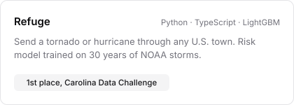
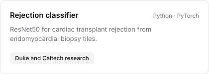
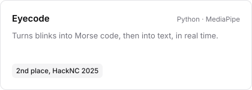

### Pranav Somalraju

ML at UNC Chapel Hill. Working on cardiac transplant pathology models with Duke and Caltech.

<a href="https://github.com/THEpranavsomalraju/gummi"><picture><source media="(prefers-color-scheme: dark)" srcset="cards/gummi-dark.svg"></picture></a>
<a href="https://github.com/THEpranavsomalraju/refuge"><picture><source media="(prefers-color-scheme: dark)" srcset="cards/refuge-dark.svg"></picture></a>
<a href="https://github.com/THEpranavsomalraju/Rejection-Classifer-Caltech-Duke"><picture><source media="(prefers-color-scheme: dark)" srcset="cards/rejection-dark.svg"></picture></a>
<a href="https://github.com/THEpranavsomalraju/eyecode"><picture><source media="(prefers-color-scheme: dark)" srcset="cards/eyecode-dark.svg"></picture></a>

Python, PyTorch, scikit-learn, LightGBM, Databricks, MLflow, FastAPI, TypeScript, React

[pranavsomalraju.vercel.app](https://pranavsomalraju.vercel.app/)
