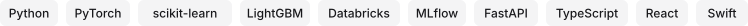

<picture>
  <source media="(prefers-color-scheme: dark)" srcset="assets/header-dark.svg">
  
</picture>

<picture>
  <source media="(prefers-color-scheme: dark)" srcset="assets/tools-dark.svg">
  
</picture>

[pranavsomalraju.vercel.app](https://pranavsomalraju.vercel.app/)
